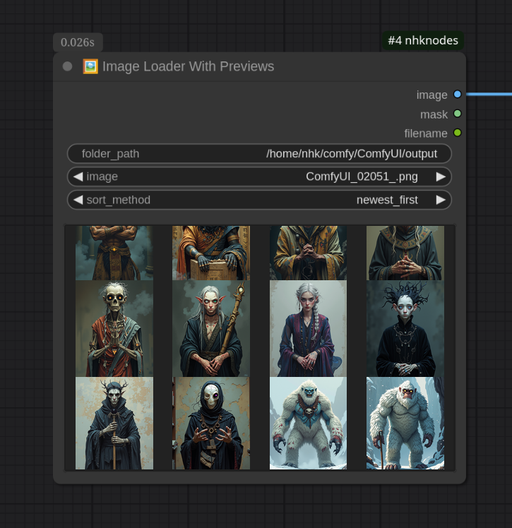
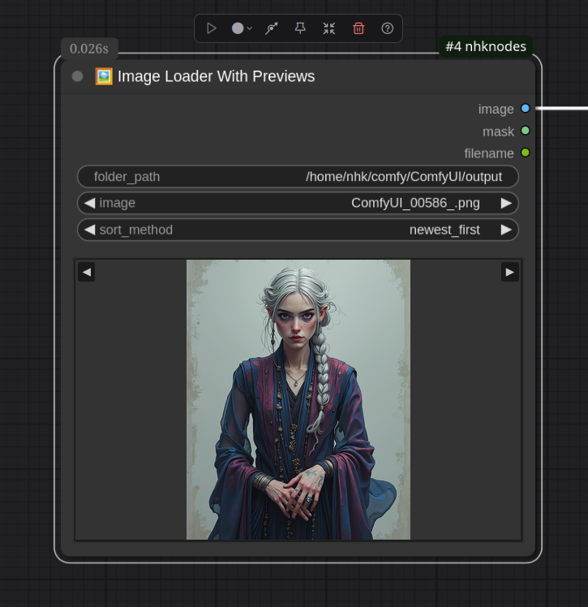

# NHK Nodes for ComfyUI

A comprehensive collection of utility nodes for ComfyUI workflows. Organized into logical categories for better workflow management.

## 🌟 Featured Node

### 🖼️ Image Loader With Previews
The standout feature of this collection - an advanced image loader that hopefully simplifies how you browse and select images in ComfyUI.

<p align="center">
  
  
</p>

- **Browse from any folder** on your system
- **Live image previews** - see images before selecting
- **Multiple sorting options**: name, date modified, created


## 📦 Installation

### Via ComfyUI Manager (Recommended)
1. Open ComfyUI Manager
2. Search for "NHK Nodes"
3. Click Install
4. Restart ComfyUI

### Manual Installation
1. Clone or download this repository to `ComfyUI/custom_nodes/nhknodes`
2. Restart ComfyUI
3. Nodes will appear in organized categories under `nhk`

## 🗂️ Node catalog

### 🔤 Text Processing (`nhk/text`)
- **📝 Simple Text Input** – Minimal text entry node that just forwards its value.
- **📄 Text Display** – Shows any incoming string inside the UI while keeping the data flowing.
- **🧩 Text Combiner** – Unlimited text inputs with automatic sockets and configurable separator.
- **🧷 Text Template** – Lightweight templating (`The [text_1] walks in the [text_2]`) with numbered placeholders.

### 🖼️ Image Processing (`nhk/image`)
- **🖼️ Image Loader With Previews** – The featured browser with searchable folders, previews, and sorting.
- **📸 Load Image Series** – Sequence loader with two modes (single_image/random). Use control_after_generate=increment for auto-advancing.
- **📦 Image Grid Batch** – Stacks arbitrary images into a batch tensor for downstream samplers.
- **🎯 Image Grid Composite** – Creates presentation grids with gutters, padding, and background control.
- **📏 Visual Resizer** – Drops any image onto a custom canvas size with precise offsets.
- **🧑 Add Headroom** – Shrinks the subject within the original canvas to create breathing room up top.
- **🎨 Edit with Krita** – Sends a frame to Krita, waits for edits, and re-imports it into the workflow.

### ⚙️ Workflow Utilities (`nhk/utility`)
- **🔄 Cycling Switch** – Rotates through unlimited inputs, staying on each for a configurable number of runs.
- **🚪 Interval Gate** – Turns a branch on/off every N executions (perfect for “every 5th image” flows).
- **🔀 Double Switch (In/Out)** – Paired A/B switches that route image/text tuples together.
- **⏱️ Execution Counter** – Counts queue runs, stops when a limit is reached, and shows progress.
- **📐 Size Picker** – Flux/SDXL/Qwen-optimized resolution presets with handy metadata.
- **🔊 Play Sound** – Small notification node that plays an audio file when a queue finishes.

### 🤖 AI & Media (`nhk/ai`)
- **🦙 Ollama API** – Local chat/vision models with hidden thinking output and optional image prompts.
- **🤖 OpenAI API** – GPT‑4/GPT‑5 chat with optional vision input (requires `OPENAI_API_KEY`).

## 🚀 Key Features

- **Dynamic Inputs** - Many nodes support unlimited inputs that auto-expand as you connect
- **Conditional Branching** - Interval Gate enables periodic workflow paths (upscale every 5th image, etc.)
- **Configurable Cycling** - Cycling Switch with stay duration control for precise input testing
- **Smart UI** - Hover tooltips and emoji icons for easy identification
- **Clean Organization** - Logical categories make nodes easy to find
- **Professional Quality** - Consistent design and error handling throughout

## 📋 Requirements

### For OpenAI API Node
- OpenAI API key in `.env` file:
  ```
  OPENAI_API_KEY=your_api_key_here
  ```
- GPT nodes support gpt-4o, gpt-4o-mini, chatgpt-4o-latest, plus gpt-5 / gpt-5-mini / gpt-5-nano.

### For Ollama API Node
- Ollama server running locally (`ollama serve`)
- Pull at least one supported model (`ollama pull qwen3-vl:8b`, etc.)
- Optional vision input works automatically when the selected model supports it

### For Edit with Krita Node
- Krita available either as AppImage, system install, or Flatpak
- Writable directory for round-tripping frames (default `/home/nhk/workspace/editing`)

## 📄 License

MIT License - Feel free to use, modify, and distribute.

## 🤝 Contributing

Contributions welcome! Please follow the existing code style and add appropriate documentation.

---

**Created by NHK** | [GitHub](https://github.com/Enashka/ComfyUI-nhknodes) | [ComfyUI Registry](https://registry.comfy.org/)
